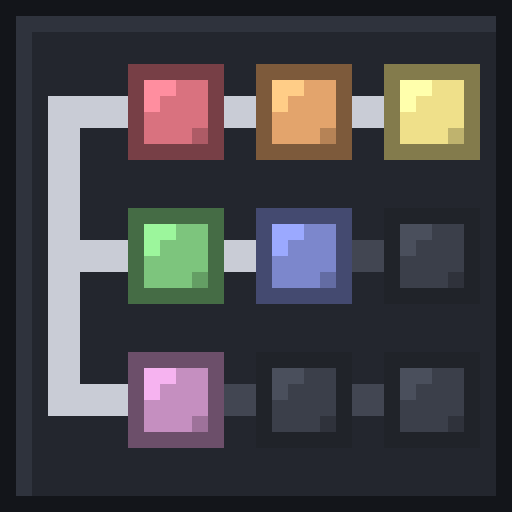

# Archipelago Advancement Tracker (Minecraft)



A **server-side** NeoForge mod that shows, during a Minecraft
[Archipelago](https://archipelago.gg) game, which advancements are doable with the items received so
far. Players keep a vanilla Minecraft client: there is nothing to install on their side.

It runs next to the randomizer mod ([NeoForgeAP](https://github.com/qixils/NeoForgeAP),
`aprandomizer`) and reads its state. It does not open a second connection to Archipelago.

This is a community project. It is not part of Archipelago or NeoForgeAP.

## What players see

- **An "Archipelago Tracker" tab in the advancements screen.** The advancements doable right now
  come first and are lit. Below them, region by region, are the ones still out of logic; hovering one
  lists the items it is waiting for (`Missing: Bucket, Progressive Tools 2`, where the number is the
  level needed). Each region says whether it is reachable and, for a shuffled structure, which
  dimension holds it. The "Progress" entry also lists what is missing to defeat the required bosses.
- **A chat message** when a received item makes new advancements doable.
- **The `/tracker` command**, which lists the doable advancements and brings the tab forward.

The mod's own texts are in English or French, following the language of each client.

## Installing

Download the jar of the [latest release](../../releases/latest) and put it in the `mods` folder of
the server that Archipelago launches, next to `Archipelago.jar`:

```
Minecraft AP Server Directory/NeoForge <version>/mods/
```

It can be added to a game that is already under way, and removed by deleting the file: the tracker
stores nothing in the world.

**One release works with one Minecraft version**, the one named on its release page, as for the
randomizer mod itself. On another version NeoForge refuses to load it and names the version it
supports.

## Building and testing

Gradle needs a JDK 17 or newer to start; it downloads the JDK that Minecraft requires by itself.

| Command | What it does |
|---|---|
| `./gradlew :mod:build` | Builds the jar into `mod/build/libs/` |
| `./gradlew :core:test` | Tests the logic engine |
| `./gradlew :mod:runGameTestServer` | Starts a server with both mods and a mock player, then checks the tab as a client receives it |

## Layout

| Folder | Content |
|---|---|
| `core/` | The logic engine in plain Java, with no Minecraft dependency: a port of the apworld's `Rules.py` |
| `mod/` | The NeoForge mod: reading the randomizer's state, the tab, the chat message, the command |
| `reference/` | The apworld and the randomizer jar the project is built and tested against |
| `tools/` | The scripts that follow NeoForgeAP releases and record the apworld's real logic |
| `gradle.properties` | Every version the build targets: Minecraft, NeoForge, the NeoForgeAP release, the tracker itself |

`RandomizerState` is the only class that touches the randomizer's classes, and `TrackerTab` the
only one that builds Minecraft advancements.

## How the logic is checked

The engine is compared with the apworld in two ways:

1. `ApworldLogicTest` replays the tests that ship **inside** the apworld (`test/test_*.py`), read
   straight from `reference/minecraft.apworld`.
2. `GoldenVectorsTest` compares the engine with results of the real Python logic, recorded by
   `tools/golden/generate_vectors.py` for 120 configurations (combat difficulty, structure compasses,
   death link, shuffled structures).

## Maintaining

The project is set up so that a routine update needs one click.

### Releases

There is no manual release step. On every push to `main`, the Build workflow runs the tests and
builds the jar; if `mod_version` in `gradle.properties` has no release yet, it creates the GitHub
release and publishes the same file to Modrinth. **To release, change `mod_version` and merge.**

Modrinth publishing needs two repository settings (Settings > Secrets and variables > Actions): the
secret `MODRINTH_TOKEN` (a Modrinth personal access token with the "Create versions", "Read
versions" and "Read projects" scopes) and the variable `MODRINTH_PROJECT_ID`. Without them that step
is skipped. After adding them, run the Build workflow by hand on `main` to publish the current
release. Modrinth tokens expire: when publishing starts failing with an authorization error, create
a new token and replace the secret.

### New NeoForgeAP releases

Every day the Upstream update workflow looks for a NeoForgeAP release newer than `upstream_release`
in `gradle.properties`. When there is one, it runs `tools/update_upstream.py`, records the new
apworld's logic, runs every test, and opens a pull request listing what passed. Opening the pull
request needs Settings > Actions > General > "Allow GitHub Actions to create and approve pull
requests"; without it the workflow opens an issue that points to the branch instead.

- **Everything passed** (usual for a fix release on the same Minecraft version): merge. The release
  follows by itself.
- **The logic tests failed**: the apworld's rules changed. The failing tests name the advancements;
  carry the changes of the apworld's `Rules.py` over to
  `core/src/main/java/aptracker/core/logic/Rules.java`, which is written in the same order.
- **The mod build or the server run failed**: expected for a new Minecraft version, whose classes
  change. The fixes are in `TrackerTab` (Minecraft's advancement classes) and `RandomizerState` (the
  randomizer's classes).

GitHub pauses scheduled workflows of a repository with no activity for 60 days; the Actions tab
offers to turn them back on.

### Doing an update by hand

```
python tools/update_upstream.py
python -m venv .venv
.venv/Scripts/pip install -r tools/golden/requirements.txt
.venv/Scripts/python tools/golden/generate_vectors.py
./gradlew :core:test :mod:build :mod:runGameTestServer
```

The recording script expects a checkout of
[Archipelago](https://github.com/ArchipelagoMW/Archipelago) in `Archipelago/` (ignored by git) and
Python 3.11 to 3.13. On Linux and macOS the virtual environment's programs are in `.venv/bin/`.

## Known limits

- Until the server is connected to Archipelago (`/connect`), the received items are unknown: the tab
  says so and only shows what is doable without any item.
- The rule of "Overkill" depends on the `exclude_locations` list of the player's YAML, which neither
  the `.apmc` file nor the Archipelago server passes on. It is assumed to be empty.
- Advancements that need a boss to be defeated are judged on items only, as in the apworld: the
  tracker does not check that the number of advancements required to make the boss appear is reached.

## License

MIT, see [LICENSE](LICENSE). The logic rules and data files come from the Archipelago Minecraft
apworld; see [THIRD_PARTY_NOTICES.md](THIRD_PARTY_NOTICES.md).
